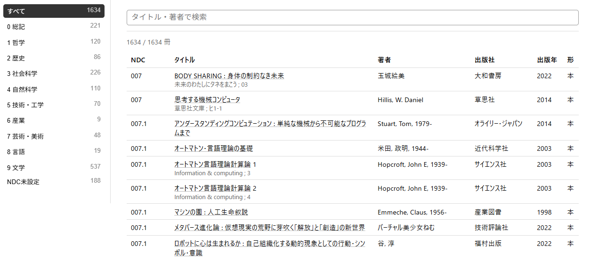

# bookshelf

個人の蔵書を閲覧するためのプライベートなWebアプリ。ISBNのリストを入力に、国立国会図書館サーチ(NDL)から書誌情報と日本十進分類法(NDC,図書館の書誌分類に使われる)を取得して作った `books.json` を、NDCメニュー・タイトル/著者のインクリメンタルサーチで閲覧する。

## 構成

- サーバーサイドの処理は一切なく、HTML/CSS/JSと`data/books.json`だけで完結する静的サイト。ビルドやパッケージ管理は不要。
- データは動的なDB/ストレージを使わず、`data/books.json` を1ファイルとしてアプリと一緒に配信するだけ。
- 画面表示の設定(NDCメニューを隠す幅・基準フォントサイズ・カーリルリンクの有無)は `config.json` にまとめてある。
- ページを開くと`config.json`と`data/books.json`を`fetch`で読み込み、NDCツリーの構築・ソート・以降の検索/絞り込みはすべてブラウザ内のJSで完結する。

```
bookshelf/
  index.html         # シェルHTML
  config.json         # 既定の表示設定
  data/books.json      # 蔵書データ
  static/app.js         # 読み込み・NDC分類・ソート・検索/絞り込み・描画
  static/style.css       # スタイル
  data/isbn13.txt          # 蔵書データ生成の入力(ISBN一覧)
  scripts/ConvertTo-BooksJson.ps1 # ISBN一覧からbooks.jsonを生成/更新するPowerShellスクリプト
```

## 実行方法

### ローカルで試す

`file://`では動かないため、リポジトリのルートで何らかの簡易HTTPサーバーを起動して開く。例:

```bash
# Node.jsがあれば
npx serve .

# Pythonがあれば
python -m http.server 8000
```

起動後、表示されたURLをブラウザで開く。

### 蔵書データ(books.json)を生成・更新する

`data/isbn13.txt` に1行1ISBNで並べたリストを元に、`scripts/ConvertTo-BooksJson.ps1` が国立国会図書館サーチ(NDL Search)のSRU APIから書誌情報・NDCを取得して `data/books.json` を生成/更新する。

```powershell
.\scripts\ConvertTo-BooksJson.ps1
```

- 既にNDC分類まで取得済みのISBNはリクエストをスキップする(`-Force`で全件再取得)。タイトルは取れたがNDLに未登録のNDCが不明なままの本は、次回実行時に自動で再試行する。
- リクエスト間隔は `-IntervalSeconds`(既定2秒)。NDL Searchへの配慮のため、短くしすぎないこと。
- `-Limit N` で試し実行(先頭N件のみ取得)ができる。
- 手動追加した電子書籍など、ISBN由来でない既存エントリはそのまま保持される。
- 生成される`format`は常に`printed`(紙)。電子書籍はとりあえず対象外。

## 画面

- 左側にNDCのメニュー。第一次区分(0〜9)を選ぶとその場で第二次区分がドリルダウン表示され、選んだNDCで一覧を絞り込む。
- ページ上部はタイトル・著者のインクリメンタルサーチと、所持形態(すべて/紙のみ/電子のみ)の絞り込み。並び替えはNDC順(同一シリーズはシリーズ名でまとめ、その中は巻次昇順)に固定。
- 所持形態(`format`)は 本(`printed`,紙) / 電(`ebook`,電子書籍) の2値。紙版と電子版はISBNが別なので、両方所持している場合はISBNごとに別エントリとして登録する。
- タイトルには、蔵書検索サービス「カーリル」の書誌ページ(`https://calil.jp/book/{ISBN}`)へのリンクを付けられる(設定ファイルの `enableCalilLink` で有効/無効を切り替え可能、デフォルトtrue)。

